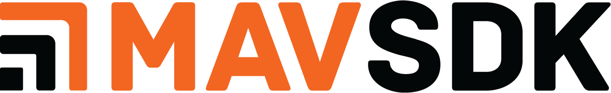

## Description

[MAVSDK](https://mavsdk.mavlink.io/main/en/) is a set of libraries providing a high-level API to [MAVLink](https://mavlink.io/en/).
It aims to be:
- Easy to use with a simple API supporting both synchronous (blocking) API calls and asynchronous API calls using callbacks.
- Fast and lightweight.
- Cross-platform (Linux, macOS, Windows, iOS, Android).
- Extensible (using the `MavlinkDirect` plugin, or the deprecated `MavlinkPassthrough` plugin).
- Fully compliant with the MAVLink standard/definitions.

The API for all languages is defined by the proto IDL ([proto files](https://github.com/mavlink/MAVSDK-Proto/tree/master/protos)), and the bindings are generated from it. This way each language gets an idiomatic API, using the tooling and syntax its users expect. For example, the Python library can be installed from PyPI using `pip`.

There are two ways a language binds to MAVSDK:
- **Directly**, by calling the C++ library through its C wrapper. This is what the C, Python and Kotlin bindings in this repository do, which means no extra process and no gRPC dependency.
- **Over gRPC**, by talking to `mavsdk_server`, a process which exposes the API on a local port. The clients that live in their own repositories work this way.

The C++ part consists of:
- The [core library](https://github.com/mavlink/MAVSDK/tree/main/cpp/src/mavsdk/core) implementing the basic MAVLink communication.
- The [plugin libraries](https://github.com/mavlink/MAVSDK/tree/main/cpp/src/mavsdk/plugins) implementing the MAVLink communication specific to a feature.
- The [mavsdk_server](https://github.com/mavlink/MAVSDK/tree/main/cpp/src/mavsdk_server) implementing the gRPC server for the language clients.

## Bindings in this repo

These are built from the C++ library and released together with it:

- [C](https://github.com/mavlink/MAVSDK/tree/main/c) - C wrapper (`libcmavsdk`), which the Python and Kotlin bindings build on.
- [Python](https://github.com/mavlink/MAVSDK/tree/main/py/mavsdk) - [`mavsdk`](https://pypi.org/project/mavsdk/) on PyPI, with a synchronous API in `mavsdk` and an asyncio API in `mavsdk.asyncio`. Since v4 this replaces the gRPC-based MAVSDK-Python, see the [migration guide](https://mavsdk.mavlink.io/main/en/python/migration.html).
- [Kotlin](https://github.com/mavlink/MAVSDK/tree/main/kt) - Kotlin Multiplatform bindings for Android and desktop JVM, using [JNI](https://github.com/mavlink/MAVSDK/tree/main/jni).

## Repos

- [MAVSDK](https://github.com/mavlink/MAVSDK) - this repo containing the source code for the C++ core, as well as the C, Python and Kotlin bindings.
- [MAVSDK-Proto](https://github.com/mavlink/MAVSDK-Proto) - Common interface definitions for API specified as proto files used by gRPC between language clients and mavsdk_server.
- [MAVSDK-Python](https://github.com/mavlink/MAVSDK-Python) - gRPC-based MAVSDK client for Python (first released on PyPI 2019), published as [`mavsdk-grpc`](https://pypi.org/project/mavsdk-grpc/) since v4. For the binding in this repo, see above.
- [MAVSDK-Swift](https://github.com/mavlink/MAVSDK-Swift) - MAVSDK client for Swift (used in production, first released 2018).
- [MAVSDK-Java](https://github.com/mavlink/MAVSDK-Java) - MAVSDK client for Java (first released on MavenCentral in 2019).
- [MAVSDK-Go](https://github.com/mavlink/MAVSDK-Go) - MAVSDK client for Go (work in progress).
- [MAVSDK-JavaScript](https://github.com/mavlink/MAVSDK-JavaScript) - MAVSDK client in JavaScript (proof of concept, 2019).
- [MAVSDK-Rust](https://github.com/mavlink/MAVSDK-Rust) - MAVSDK client for Rust (proof of concept, 2019).
- [MAVSDK-CSharp](https://github.com/mavlink/MAVSDK-CSharp) - MAVSDK client for CSharp (proof of concept, 2019).
- [Docs](https://github.com/mavlink/MAVSDK/tree/main/docs) - MAVSDK [docs](https://mavsdk.mavlink.io/main/en/) source.

## Docs

Instructions for how to use the C++ library can be found in the [MAVSDK docs](https://mavsdk.mavlink.io/main/en/) (links to other programming languages can be found from the documentation sidebar).

Quick Links:

- [Getting started](https://mavsdk.mavlink.io/main/en/cpp/#getting-started)
- [C++ API Overview](https://mavsdk.mavlink.io/main/en/cpp/#api-overview)
- [API Reference](https://mavsdk.mavlink.io/main/en/cpp/api_reference/)
- [Installing the Library](https://mavsdk.mavlink.io/main/en/cpp/guide/installation.html)
- [Building the Library](https://mavsdk.mavlink.io/main/en/cpp/guide/build.html)
- [Examples](https://mavsdk.mavlink.io/main/en/cpp/examples/)
- [FAQ](https://mavsdk.mavlink.io/main/en/faq.html)

## License

This project is licensed under the permissive BSD 3-clause, see [LICENSE.md](LICENSE.md).

## Maintenance

This project is maintained by volunteers:
- [Julian Oes](https://github.com/julianoes) ([sponsoring](https://github.com/sponsors/julianoes), [consulting](https://julianoes.com)).
- [Jonas Vautherin](https://github.com/JonasVautherin)

Maintenance is not sponsored by any company, however, hosting of the [docs](https://mavsdk.mavlink.io/main/en/) and the [forum](https://discuss.px4.io/c/mavsdk/) is provided by the [Dronecode Foundation](https://dronecode.org).

## Support and issues

If you just have a question, consider asking in the [forum](https://discuss.px4.io/c/mavsdk/).

If you have run into an issue, discovered a bug, or want to request a feature, create an [issue](https://github.com/mavlink/MAVSDK/issues). If it is important or urgent to you, consider sponsoring any of the maintainers to move the issue up on their todo list.

If you need private support, consider paid consulting:
- [Julian Oes consulting](https://julianoes.com)

(Create a pull request if you wish to be listed here.)
