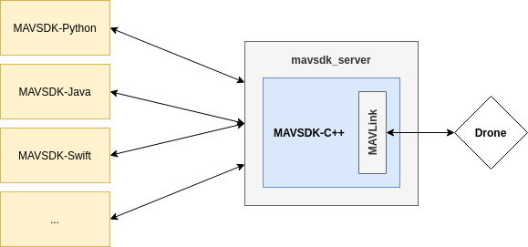
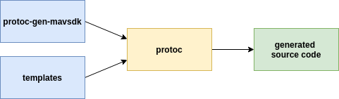

# Autogeneration

MAVSDK is available in a number of different languages.
These all share the same "core" MAVLink implementation written in C++. Most of the API-specific code for other languages is *autogenerated* from API definition files (and language-specific templates).

This approach means that we don't have to maintain a separate MAVLink implementation or API for each language.
New features are implemented once in C++, and can then be automatically be rolled out in Python, Java, etc.

This page provides an overview of the architecture and explains how to add a feature using the autogeneration.

## Overview

The common MAVLink implementation is written in C++ (it is part of MAVSDK-C++).
The `mavsdk_server` exposes the MAVSDK-C++ API over [gRPC](https://grpc.io/) to the language bindings.
The API for all languages is autogenerated from a common definition.

The following parts are autogenerated:

* MAVSDK-C++ API (i.e. header files)
* Most of `mavsdk_server`
* Most of the language bindings

Those parts are maintained manually:

* MAVSDK-C++ implementation (i.e. the MAVLink business logic)
* New plugins need to be added to `mavsdk_server` (this may be automated in future)
* The `System` wrapper in language bindings usually needs to be updated whenever a new plugin is added (this may be automated in future)

The heart of the autogeneration system is the [MAVSDK-Proto](https://github.com/mavlink/mavsdk-proto) repository which is described [below](#mechanisms).

## Autogeneration Mechanisms {#mechanisms}

The autogeneration pipeline is shown below:

The main parts are:

* [`protoc-gen-mavsdk`](https://github.com/mavlink/MAVSDK-Proto/tree/main/pb_plugins), which is a `protoc` custom plugin generating MAVSDK's code.
* [The API definition](https://github.com/mavlink/MAVSDK-Proto/tree/main/protos), in the form of proto files.
* Template files (per language, see e.g. the [Python templates](https://github.com/mavlink/MAVSDK-Python/tree/main/other/templates/py) or the [C++ templates](https://github.com/mavlink/MAVSDK/tree/main/templates)).

`protoc` takes the custom plugin (`protoc-gen-mavsdk`) and the template files as inputs, and generate source code out of it.
The way it currently works is that it generates one source file out of each `*.proto` file. For instance, `action.proto` becomes `Action.java` in MAVSDK-Java.

In some languages (typically C++), we need to generate multiple source files out of one proto definition file, and this is the reason why the C++ generation script runs protoc [in](https://github.com/mavlink/MAVSDK/blob/6434e0c6a7c25a3203d4652da13ea1944279beb1/tools/generate_from_protos.sh#L72-L74) [multiple](https://github.com/mavlink/MAVSDK/blob/6434e0c6a7c25a3203d4652da13ea1944279beb1/tools/generate_from_protos.sh#L76-L77) [passes](https://github.com/mavlink/MAVSDK/blob/6434e0c6a7c25a3203d4652da13ea1944279beb1/tools/generate_from_protos.sh#L79-L81), once [for each template](https://github.com/mavlink/MAVSDK/blob/6434e0c6a7c25a3203d4652da13ea1944279beb1/tools/generate_from_protos.sh#L61) (e.g. "templates/plugin_h" defines the templates to generate `action.h`, `telemetry.h`, ..., and "templates/plugin_cpp" is responsible for `action.cpp`, `telemetry.cpp`, ...).

All the MAVSDK repositories contain some kind of `generate_from_proto.sh` file, and a `templates/` directory:

* MAVSDK-C++: [script](https://github.com/mavlink/MAVSDK/blob/main/tools/generate_from_protos.sh), [templates](https://github.com/mavlink/MAVSDK/tree/main/templates)
* MAVSDK-Python: [script](https://github.com/mavlink/MAVSDK-Python/blob/main/other/tools/run_protoc.sh), [templates](https://github.com/mavlink/MAVSDK-Python/tree/main/other/templates/py)
* MAVSDK-Swift: [script](https://github.com/mavlink/MAVSDK-Swift/blob/main/Sources/Mavsdk/tools/generate_from_protos.bash), [templates](https://github.com/mavlink/MAVSDK-Swift/tree/main/Sources/Mavsdk/templates)
* MAVSDK-Java: [script](https://github.com/mavlink/MAVSDK-Java/blob/983b361aa42b9088abbf17037d762ac174b44308/sdk/build.gradle#L54-L73), [templates](https://github.com/mavlink/MAVSDK-Java/tree/main/sdk/templates)
* MAVSDK-C#: [script](https://github.com/mavlink/MAVSDK-CSharp/blob/f989aae79a0d62d6b92bac9120a89fc85ba80006/MAVSDK-CSharp/MAVSDK/MAVSDK.csproj#L18-L31), [templates](https://github.com/mavlink/MAVSDK-CSharp/tree/main/MAVSDK-CSharp/MAVSDK/templates)
* MAVSDK-Go: [script](https://github.com/mavlink/MAVSDK-Go/blob/main/tools/generate_from_protos.bash), [templates](https://github.com/mavlink/MAVSDK-Go/tree/main/templates)

## Adding a New Feature

When adding a new feature to MAVSDK it is important to think first about the API that is required, and later about the implementation needed to enable the feature. This is not only because MAVSDK strives to have a simple and safe API but also comes from the fact that a new feature needs to be defined in the API first and can then be implemented (using the autogenerated files) in a later step.

To add a new feature, follow the steps on [how to write plugins](plugins.md#add-api-to-proto).
