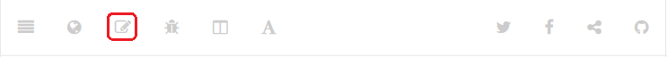
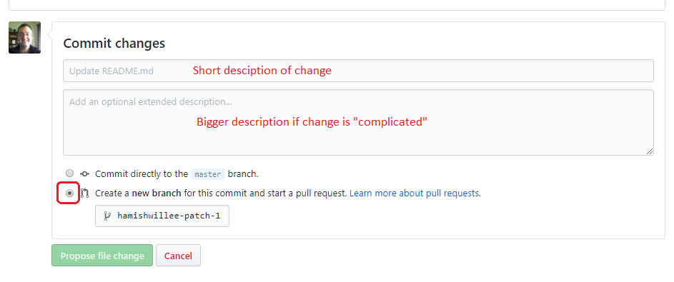
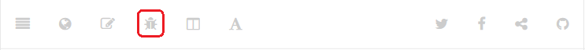

# Contributing to Documentation

Making quick fixes to existing text or raising issues is very easy.
If you want to help, [get in touch](../../index.md#getting-help).

::: tip
You will need a [Github](https://github.com/) login to make and submit changes to this guide.
:::

## Overview

This guide is written in [markdown](https://github.com/GitbookIO/gitbook/blob/master/docs/syntax/markdown.md) wiki syntax and stored in the Github [mavlink/MAVSDK-docs](https://github.com/mavlink/MAVSDK-docs) repo.

The [API Reference](../api_reference/index.md) section is compiled from source code into markdown using a [separate toolchain](#api-reference) and then copied into Github.
Updates to the reference should be made in the [source code repository](https://github.com/mavlink/MAVSDK) (see [API Reference](#api-reference) below for more information).

The guide is licensed under [CC BY 4.0](https://creativecommons.org/licenses/by/4.0/) - if you make any changes then they will be made available under the same license.

## Making a Quick Fix

Simple fixes to an existing page can be made directly on Github:

1. Click the **Edit** button in the top toolbar to open the page

   

1. Make required changes in the editor section near the top of the page.
2. At the bottom of the page, add a comment and select the second radio button to create a new branch.

   

3. Follow the on-screen instructions to create a pull request with your change.

## Raising an Issue

To raise an issue against the documentation:

1. Open the page with problem content.
1. Click the **Bug** button in the top toolbar.

   

   This will open a bug in Github, seeded with the URL/name for the current page.
1. Enter enough information for someone to understand the problem, and ideally to fix it.

TODO: still valid?

## Making a Big Change

If you want to make more significant changes or additions to the documentation you will need to set up *Git* and the *Gitbook* toolchain (this allows you to render the documentation and check that links work).

For setup information see: [Gitbook toolchain](https://github.com/GitbookIO/gitbook/blob/master/docs/setup.md).

## API Reference

The C++ public header files are annotated using docstrings using [Doxygen](http://doxygen.nl/manual/index.html) syntax.
You can extract the documentation to markdown files (one per class) on macOS or Linux using the instructions in [Build API Reference Documentation](../guide/build_docs.md).

In order to include new API reference in the *SDK Documentation* it must be manually added to the [Github repository](https://github.com/mavlink/MAVSDK-docs):
- Copy the files into the [/en/cpp/api_reference](https://github.com/mavlink/MAVSDK-docs/tree/main/en/cpp/api_reference) folder
- *New* APIs should be added to appropriate sections in the [MAVSDK-docs/en/SUMMARY.md](https://github.com/mavlink/MAVSDK-docs/blob/main/en/SUMMARY.md) and [/en/cpp/api_reference/index.md](https://github.com/mavlink/MAVSDK-docs/blob/main/en/cpp/api_reference/index.md).
