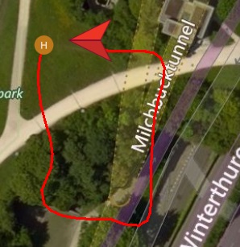

# Example: Follow Me Mode

This example demonstrates how to use the [Follow Me](../guide/follow_me.md) plugin.
It shows how to send the drone both the current position of the target (`FollowMe::TargetLocation`) and the relative position at which it should follow (`FollowMe::Config`).



::: info
A real application using this API will get the position information from the underlying operating system.
The example uses a fake position source (`FakeLocationProvider`) to enable it to be run on computers that do not have position information.
The `FakeLocationProvider` emulates the typical usage of common positioning APIs used in Android, Linux and iPhone.
:::


## Running the Example {#run_example}

Special notes for this example:

* Before running this example you will need to install Boost libraries. For Linux this is done as shown below:
  ```sh
  sudo apt-get install libboost-all-dev
  ```
* To use *QGroundControl* with this example you **must** ensure that *GSC Position Streaming* is disabled (otherwise QGC and the SDK will both send position updates and they will conflict).
  To do this use the latest *QGC Daily Build* and ensure that the **[Application Setting > General](https://docs.qgroundcontrol.com/en/SettingsView/General.html) > Miscellaneous > Stream GCS Position** is set to *Never*.

Otherwise the example is built and run in the normal way ([as described here](../examples/index.md#trying_the_examples)).

The example terminal output should be similar to that shown below:

::: info
This is from a debug build of the SDK.
A release build will omit the "Debug" messages.
:::

```
$ ./follow_me udpin://0.0.0.0:14540
```
```
[01:55:59|Info ] DronecodeSDK version: 0.2.8 (dronecode_sdk_impl.cpp:25)
Wait for system to connect via heartbeat
[01:55:59|Info ] New device on: 127.0.0.1:14580 (udp_connection.cpp:200)
[01:55:59|Debug] New: System ID: 1 Comp ID: 1 (dronecode_sdk_impl.cpp:286)
[01:55:59|Debug] Component Autopilot added. (system_impl.cpp:335)
[01:56:00|Debug] Found 1 component(s). (system_impl.cpp:462)
[01:56:00|Debug] Discovered 4294967298 (system_impl.cpp:464)
Waiting for system to be ready
...
Waiting for system to be ready
System is ready
Armed
[01:56:07|Debug] MAVLink: info: ARMED by arm/disarm component command (system_impl.cpp:273)
In Air...
[01:56:07|Debug] MAVLink: info: Using minimum takeoff altitude: 2.50 m (system_impl.cpp:273)
[01:56:07|Debug] MAVLink: info: Takeoff detected (system_impl.cpp:273)
[01:56:07|Debug] MAVLink: info: Using minimum takeoff altitude: 2.50 m (system_impl.cpp:273)
[FlightMode: Takeoff] Vehicle is at: nan, nan degrees.
[FlightMode: Takeoff] Vehicle is at: nan, nan degrees.
[FlightMode: Hold] Vehicle is at: nan, nan degrees.
[01:56:12|Debug] Waiting for the system confirmation of the new configuration.. (follow_me_impl.cpp:81)
[FlightMode: FollowMe] Vehicle is at: nan, nan degrees.
[FlightMode: FollowMe] Vehicle is at: 47.3977, 8.54559 degrees.
[FlightMode: FollowMe] Vehicle is at: 47.3977, 8.54559 degrees.
[FlightMode: FollowMe] Vehicle is at: 47.3976, 8.54559 degrees.
[FlightMode: FollowMe] Vehicle is at: 47.3976, 8.54559 degrees.
[FlightMode: FollowMe] Vehicle is at: 47.3976, 8.54559 degrees.
[FlightMode: FollowMe] Vehicle is at: 47.3975, 8.54559 degrees.
[FlightMode: FollowMe] Vehicle is at: 47.3975, 8.54559 degrees.
[FlightMode: FollowMe] Vehicle is at: 47.3974, 8.54559 degrees.
[FlightMode: FollowMe] Vehicle is at: 47.3974, 8.54559 degrees.
[FlightMode: FollowMe] Vehicle is at: 47.3974, 8.54563 degrees.
[FlightMode: FollowMe] Vehicle is at: 47.3974, 8.54567 degrees.
[FlightMode: FollowMe] Vehicle is at: 47.3974, 8.5457 degrees.
[FlightMode: FollowMe] Vehicle is at: 47.3974, 8.54574 degrees.
[FlightMode: FollowMe] Vehicle is at: 47.3974, 8.54577 degrees.
[FlightMode: FollowMe] Vehicle is at: 47.3974, 8.54581 degrees.
[FlightMode: FollowMe] Vehicle is at: 47.3974, 8.54588 degrees.
[FlightMode: FollowMe] Vehicle is at: 47.3974, 8.54592 degrees.
[FlightMode: FollowMe] Vehicle is at: 47.3974, 8.54595 degrees.
[FlightMode: FollowMe] Vehicle is at: 47.3974, 8.54595 degrees.
[FlightMode: FollowMe] Vehicle is at: 47.3975, 8.54595 degrees.
[FlightMode: FollowMe] Vehicle is at: 47.3975, 8.54595 degrees.
[FlightMode: FollowMe] Vehicle is at: 47.3975, 8.54595 degrees.
[FlightMode: FollowMe] Vehicle is at: 47.3976, 8.54595 degrees.
[FlightMode: FollowMe] Vehicle is at: 47.3976, 8.54595 degrees.
[FlightMode: FollowMe] Vehicle is at: 47.3977, 8.54595 degrees.
[FlightMode: FollowMe] Vehicle is at: 47.3977, 8.54595 degrees.
[FlightMode: FollowMe] Vehicle is at: 47.3977, 8.54595 degrees.
[FlightMode: FollowMe] Vehicle is at: 47.3977, 8.54592 degrees.
[FlightMode: FollowMe] Vehicle is at: 47.3977, 8.54588 degrees.
[FlightMode: FollowMe] Vehicle is at: 47.3977, 8.54581 degrees.
[FlightMode: FollowMe] Vehicle is at: 47.3977, 8.54577 degrees.
[FlightMode: FollowMe] Vehicle is at: 47.3977, 8.54574 degrees.
[FlightMode: FollowMe] Vehicle is at: 47.3977, 8.5457 degrees.
[FlightMode: FollowMe] Vehicle is at: 47.3977, 8.54567 degrees.
[FlightMode: FollowMe] Vehicle is at: 47.3977, 8.54563 degrees.
[FlightMode: FollowMe] Vehicle is at: 47.3977, 8.54563 degrees.
waiting until landed
[01:56:53|Debug] MAVLink: info: Landing at current position (system_impl.cpp:273)
waiting until landed
...
waiting until landed
[01:57:12|Debug] MAVLink: info: Landing detected (system_impl.cpp:273)
[01:57:12|Debug] MAVLink: info: DISARMED by auto disarm on land (system_impl.cpp:273)
Landed...
```

## How it works

The example registers with `FakeLocationProvider` for location updates.
These are passed to the Follow Me plugin, which in turn sends them to the vehicle.

The operation of the "SDK-specific" part of this code is discussed in the guide: [Follow Me](../guide/follow_me.md).


## Source code {#source_code}

- [CMakeLists.txt](https://github.com/mavlink/MAVSDK/blob/main/examples/follow_me/CMakeLists.txt)
- [follow_me.cpp](https://github.com/mavlink/MAVSDK/blob/main/examples/follow_me/CMakeLists.txt)
