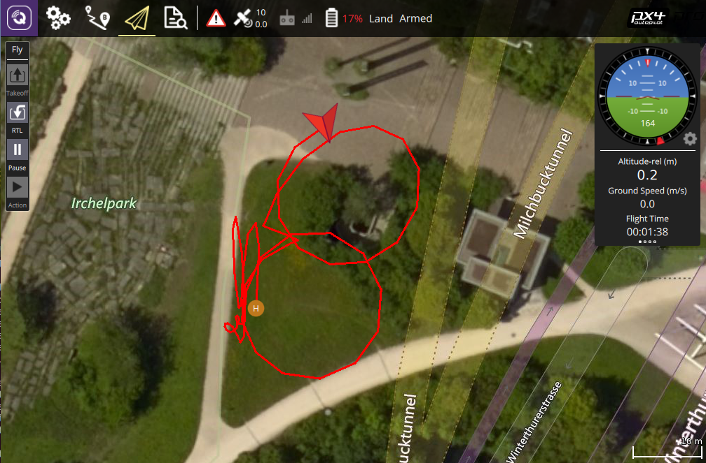

# Example: Offboard Velocity

This example shows how to how to control a vehicle in *Offboard mode* using velocity commands (in both the NED and body frames).




## Running the Example {#run_example}

The example is built and run [as described here](../examples/index.md#trying_the_examples) (the standard way).

The example terminal output should be similar to that shown below:

::: info
This is from a debug build of the SDK.
A release build will omit the "Debug" messages.
:::

```
$ ./offboard udp://:14540
```
```
Wait for system to connect via heartbeat
[12:53:03|Info ] New device on: 127.0.0.1:14557 (udp_connection.cpp:208)
[12:53:03|Debug] New: System ID: 1 Comp ID: 1 (dronecode_sdk_impl.cpp:286)
[12:53:03|Debug] Component Autopilot added. (mavlink_system.cpp:349)
[12:53:03|Debug] MAVLink: info: [logger] file: rootfs/fs/microsd/log/2018-05-23/0 (mavlink_system.cpp:286)
[12:53:04|Debug] Found 1 component(s). (mavlink_system.cpp:481)
[12:53:04|Debug] Discovered 4294967298 (mavlink_system.cpp:483)
Waiting for system to be ready
System is ready
Armed
[12:53:05|Debug] MAVLink: info: ARMED by arm/disarm component command (mavlink_system.cpp:286)
In Air...
[12:53:05|Debug] MAVLink: info: Using minimum takeoff altitude: 2.50 m (mavlink_system.cpp:286)
[12:53:05|Debug] MAVLink: info: Takeoff detected (mavlink_system.cpp:286)
[12:53:05|Debug] MAVLink: critical: Using minimum takeoff altitude: 2.50 m (mavlink_system.cpp:286)
[NED] Offboard started
[NED] Turn to face East
[NED] Go North and back South
[NED] Turn to face West
[NED] Go up 2 m/s, turn to face South
[NED] Go down 1 m/s, turn to face North
[NED] Offboard stopped
[BODY] Offboard started
[BODY] Turn clock-wise and climb
[BODY] Turn back anti-clockwise
[BODY] Wait for a bit
[BODY] Fly a circle
[BODY] Wait for a bit
[BODY] Fly a circle sideways
[BODY] Wait for a bit
[BODY] Offboard stopped
[12:54:29|Debug] MAVLink: info: Landing at current position (mavlink_system.cpp:286)
Landed
```

## How it works

The operation of most of this code is discussed in the guide: [Offboard Control](../guide/offboard.md).

## Source code {#source_code}

- [CMakeLists.txt](https://github.com/mavlink/MAVSDK/blob/main/examples/offboard/CMakeLists.txt)
- [offboard_velocity.cpp](https://github.com/mavlink/MAVSDK/blob/main/examples/offboard/offboard.cpp)
