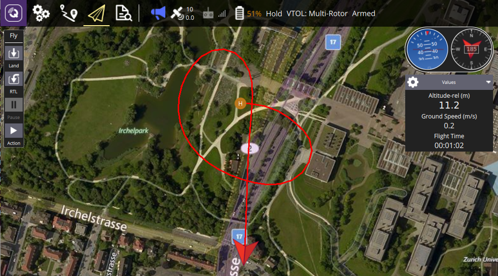

# Example: VTOL Transitions

This example shows how you can use the SDK [Action](../api_reference/classmavsdk_1_1_action.md) class to transition between VTOL copter and fixed-wing modes (and back).




## Running the Example {#run_example}

The example must be run against a VTOL aircraft (simulated or otherwise).
Otherwise the example is built and run [in the standard way](../examples/index.md#trying_the_examples).

::: tip
Instructions for running the Gazebo simulator for a standard VTOL can be found here: [PX4 Development Guide > Gazebo Simulation](https://docs.px4.io/master/en/simulation/gazebo.html#standard-vtol).
jMAVSim does not support VTOL simulation.
:::

The example terminal output for a debug build of the SDK should be similar to that shown below (a release build will omit the "Debug" messages):

```
$ ./transition_vtol_fixed_wing udp://:14540
```
```
Waiting to discover system...
[10:24:42|Info ] New system on: 127.0.0.1:14557 (udp_connection.cpp:210)
[10:24:42|Debug] MAVLink: info: [logger] file: rootfs/fs/microsd/log/2017-11-21/0 (mavlink_system.cpp:286)
[10:24:43|Debug] Discovered 4294967298 (mavlink_system.cpp:483)
Discovered system with UUID: 4294967298
Arming...
Taking off...
[10:24:44|Debug] MAVLink: info: ARMED by arm/disarm component command (mavlink_system.cpp:286)
[10:24:44|Debug] MAVLink: info: Using minimum takeoff altitude: 10.00 m (mavlink_system.cpp:286)
[10:24:44|Debug] MAVLink: info: Takeoff detected (mavlink_system.cpp:286)
[10:24:44|Debug] MAVLink: critical: Using minimum takeoff altitude: 10.00 m (mavlink_system.cpp:286)
Altitude: 0.079 m
Altitude: 0.507 m
...
Altitude: 10.254 m
Transition to fixedwing...
Altitude: 10.263 m
...
Altitude: 20.72 m
Altitude: 24.616 m
Altitude: 22.262 m
Transition back to multicopter...
Altitude: 17.083 m
...
Return to launch...
Altitude: 11.884 m
[10:25:09|Debug] MAVLink: info: RTL: climb to 518 m (29 m above home) (mavlink_system.cpp:286)
Altitude: 13.61 m
...
Altitude: 27.489 m
Altitude: 28.892 m
[10:25:18|Debug] MAVLink: info: RTL: return at 517 m (29 m above home) (mavlink_system.cpp:286)
Altitude: 29.326 m
Altitude: 29.33 m
...
Altitude: 29.323 m
Altitude: 29.357 m
Landing...
[10:25:29|Debug] MAVLink: info: Landing at current position (mavlink_system.cpp:286)
Altitude: 29.199 m
Altitude: 28.722 m
Altitude: 28.189 m
Altitude: 27.62 m
Finished...
```


## How it works

The operation of the transition code is discussed in the guide: [Takeoff and Landing (and other actions)](../guide/taking_off_landing.md#transition_vtol).

## Source code {#source_code}

- [CMakeLists.txt](https://github.com/mavlink/MAVSDK/blob/main/examples/transition_vtol_fixed_wing/CMakeLists.txt)
- [transition_vtol_fixed_wing.cpp](https://github.com/mavlink/MAVSDK/blob/main/examples/transition_vtol_fixed_wing/transition_vtol_fixed_wing.cpp)
