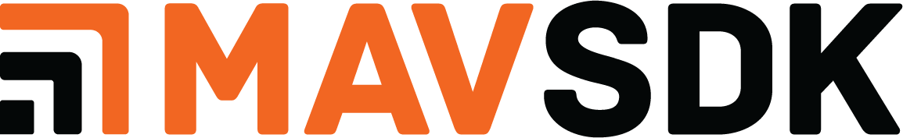

<div style="float:right; padding:10px; margin-right:20px;"></div>

# MAVSDK (main / v4)

*MAVSDK* is a collection of libraries for various programming languages to interface with [MAVLink](https://mavlink.io/en/) systems such as drones, cameras or ground systems.

The libraries provide a simple API for managing one or more vehicles, providing programmatic access to vehicle information and telemetry, and control over missions, movement and other operations.

The libraries can be used onboard a drone on a companion computer or on the ground for a ground station or mobile device.

MAVSDK is cross-platform: Linux, macOS, Windows, Android and iOS.

## About This Documentation

This documentation lives in the main [MAVSDK repository](https://github.com/mavlink/MAVSDK) under `docs/` at the repository root. It was previously maintained in a separate `MAVSDK-docs` repository and stored under `cpp/docs/` within this repository. Consolidating the docs here makes it easier to keep documentation in sync with code changes: a single pull request can update both the implementation and its documentation.

The site covers all MAVSDK language bindings. Each language has its own section with guides and API reference.

## Programming Languages

MAVSDK is primarily written in C++ with wrappers available for several programming languages:

- [MAVSDK-C++](https://github.com/mavlink/MAVSDK) (2016): Used in production.
- [MAVSDK-Swift](https://github.com/mavlink/MAVSDK-Swift) (2018): Used in production.
- [MAVSDK-Python](https://github.com/mavlink/MAVSDK-Python) (2019): Used in production (gRPC-based; see note below).
- [MAVSDK-Java](https://github.com/mavlink/MAVSDK-Java) (2019): Used in production.
- [MAVSDK-Go](https://github.com/mavlink/MAVSDK-Go) (2020): Proof of concept.
- [MAVSDK-JavaScript](https://github.com/mavlink/MAVSDK-JavaScript) (2019): Proof of concept.
- [MAVSDK-CSharp](https://github.com/mavlink/MAVSDK-CSharp) (2019): Proof of concept.
- [MAVSDK-Rust](https://github.com/mavlink/MAVSDK-Rust) (2019): Proof of concept.

## New Python Wrappers (`mavsdk` and `aiomavsdk`)

In addition to the existing [MAVSDK-Python](https://github.com/mavlink/MAVSDK-Python) package, this repository now includes two new Python packages under `py/`:

- **`mavsdk`** — Synchronous bindings that call the C library (`libcmavsdk`) directly. No gRPC, no separate server process.
- **`aiomavsdk`** — An asyncio wrapper around `mavsdk` that provides an `async`/`await` API deliberately similar to MAVSDK-Python, to ease migration.

### How they differ from MAVSDK-Python

The original MAVSDK-Python works by spawning a `mavsdk_server` sidecar process and communicating with it over gRPC. This works well but adds deployment complexity and a runtime dependency on the server binary.

The new packages call `libcmavsdk` directly via the C wrapper layer (`cpp/src/mavsdk_c/`). The result is a self-contained Python package with no gRPC dependency and no external process. The API surface is generated from the same protobuf definitions used by the rest of the MAVSDK ecosystem, so new plugins added to C++ become available in Python with minimal additional work.

### Direction

The long-term intent is for these packages to replace MAVSDK-Python. They are newer and have not been tested as extensively as MAVSDK-Python, but they implement the full plugin API. Migration from MAVSDK-Python to `aiomavsdk` should require only minor changes because the async API is intentionally similar.

See the [Python section](python/index.md) for installation instructions, guides, and the full API reference.

## Navigating the Docs

| Section | Content |
|---------|---------|
| [C++](cpp/index.md) | Guide, examples, API reference, and contributing docs for the C++ library |
| [Python](python/index.md) | Guide and API reference for the new `mavsdk` and `aiomavsdk` packages |
| [Swift](swift/index.md) | Index for MAVSDK-Swift |
| [FAQ](faq.md) | Frequently asked questions |

## Contributing to Documentation

Documentation source files are Markdown, rendered with [VitePress](https://vitepress.dev/). They live under `docs/en/` in the MAVSDK repository.

- **C++ API reference** is generated from Doxygen comments in the source headers. Regenerate with `cpp/tools/generate_docs.sh`.
- **Python API reference** is generated from docstrings using an AST-based tool. Regenerate with `tools/generate_docs.sh` (which calls `py/tools/generate_markdown.py`).
- **Guides and conceptual docs** are written by hand. When adding a new guide, place it under the appropriate language section (`docs/en/cpp/`, `docs/en/python/`, etc.) and link it from the section index.
- **Cross-language guides** that apply to all language bindings belong at `docs/en/` level.

To preview the documentation site locally:

```sh
cd docs
npm install   # or yarn install
npm run dev   # or yarn dev
```

## Getting Started

Check out the quickstart guide for [C++](cpp/quickstart.md) and [Python](python/quickstart.md).
And no matter which language you are using, use the [C++ Guide](cpp/guide/index.md) to learn how to
perform common tasks and use the library in general.

## Getting Help {#getting-help}

This guide contains information and examples showing how to use MAVSDK.
If you have specific questions that are not answered by the documentation, these can be raised on:

* [Discuss board](https://discuss.px4.io/c/mavsdk)
* [Discord (#mavsdk)](https://discord.gg/dronecode)

Use Github for bug reports/enhancement requests:

* [C++ API](https://github.com/mavlink/MAVSDK/issues)
* [Swift API and docs](https://github.com/mavlink/MAVSDK-Swift/issues)
* [Python API and docs](https://github.com/mavlink/MAVSDK-Python/issues)
<!-- Add info about where other API issues are reported). -->


## Contributing

We welcome contributions! If you want to help or have suggestions/bug reports [please get in touch with the development team](#getting-help).

The [Contributing](cpp/contributing/index.md) (C++) section contains more information on how and what to contribute, including topics about building MAVSDK from source code, running our integration and unit tests, and all other aspects of core development.

## Maintenance

This project is maintained by volunteers:
- [Julian Oes](https://github.com/julianoes) ([sponsoring](https://github.com/sponsors/julianoes), [consulting](https://julianoes.com)).
- [Jonas Vautherin](https://github.com/JonasVautherin)

Maintenance is not sponsored by any company, however, hosting of the [docs](https://mavsdk.mavlink.io/main/en/) and the [forum](https://discuss.px4.io/c/mavsdk/) is provided by the [Dronecode Foundation](https://dronecode.org).

## Support and issues

If you just have a question, consider asking in the [forum](https://discuss.px4.io/c/mavsdk/).

If you have run into an issue, discovered a bug, or want to request a feature, create an [issue](https://github.com/mavlink/MAVSDK/issues). If it is important or urgent to you, consider sponsoring any of the maintainers to move the issue up on their todo list.

If you need private support, consider paid consulting:
- [Julian Oes consulting](https://julianoes.com)

(Create a pull request if you wish to be listed here.)

## License

* The *MAVSDK* is licensed under the permissive [BSD 3-clause](https://github.com/mavlink/MAVSDK/blob/main/LICENSE.md).
* This documentation is licensed under [CC BY 4.0](https://creativecommons.org/licenses/by/4.0/) license.

## Governance

The MAVSDK project is hosted under the governance of the [Dronecode Foundation](https://www.dronecode.org/).

<a href="https://www.dronecode.org/" style="padding:20px" ></a>
<a href="https://www.linuxfoundation.org/projects" style="padding:20px;"></a>
<div style="padding:10px">&nbsp;</div>
