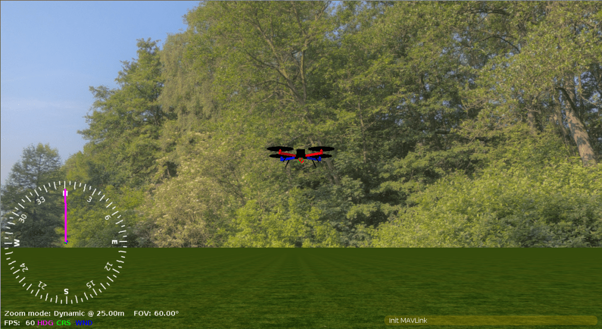
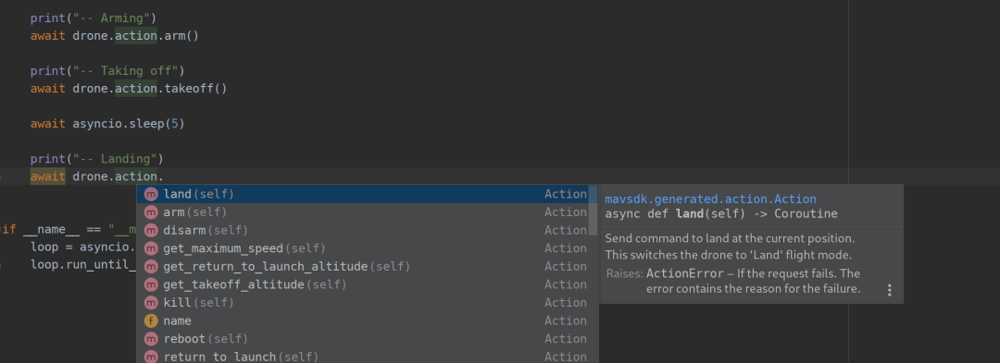

# Python QuickStart

## Prerequisites

* __Python 3.6+:__ run `python --version` or `python3 --version` in a terminal to check the installed version.
* __A running SITL instance__ ([jMAVSim](https://docs.px4.io/master/en/simulation/jmavsim.html), [gazebo](https://docs.px4.io/master/en/simulation/gazebo.html), …).
  A quick way to run a headless gazebo SITL instance using docker is documented [here](https://github.com/jonasvautherin/px4-gazebo-headless).

## Install

MAVSDK-Python is distributed through [PyPi](https://pypi.org/project/mavsdk/), and can therefore be installed with `pip3`:

```sh
pip3 install mavsdk
```

Make sure that the output of this command confirms that the installation succeeded!

> **Tip** On some systems, you may have to run `pip3 install --user mavsdk`, or you may want to run in a Python venv.

For the quick start below we will also install the lightweight package called “aioconsole”.
This provides a REPL (interactive shell) called `apython` that we can use for running asyncio code:

```sh
pip3 install aioconsole
```

## Run SITL

It is always good to make sure that SITL works before trying to connect MAVSDK to it.
One way is to run the following commands in the `pxh>` prompt when SITL is running:

```
commander takeoff
commander land
```

The simulated drone should takeoff and land.
If it doesn't, it may mean that SITL is not ready, or that there is a problem.

## Take off from MAVSDK

When we know that the simulator is ready, we can open an `apython` REPL:
```sh
apython
```

Import MAVSDK into the environment by entering:
```python
from mavsdk import System
```

We then create a `System` object, in this case named `drone`, and make it connect to the drone (this object is our "handle" to access the rest of the MAVSDK functions):
```python
drone = System()
await drone.connect()
```

Once connected, we can arm and takeoff using the appropriate MAVSDK commands:

```python
await drone.action.arm()
await drone.action.takeoff()
```

If everything went well, your drone should takeoff.
In the `pxh` console, you should see a log line like:

```bash
INFO [commander] Takeoff detected
```

If running a graphical interface, you should see the drone taking off.
Here is what it looks like in jMAVSim:



> **Note** Make sure to send the `takeoff()` command within (at most) a few seconds of `arm()`; the drone will automatically disarm after a few seconds if it does not receive a command to takeoff.

You get an exception, as shown below:
```python
raise ActionError(result, “arm()”)
mavsdk.generated.action.ActionError: COMMAND_DENIED: ‘Command denied’; origin: arm(); params: ()
```

This is not a bug! It means that the `arm()` call was rejected by PX4, with the error code `COMMAND_DENIED`.
It happens for instance when you try to arm before the drone gets a GPS fix.
Most functions in MAVSDK-Python can raise exceptions that your code should handle with `try... except`.

Now that the drone is flying, we can land:

```python
await drone.action.land()
```

> **Note** We have been using the apython REPL to run all that interactively, but the same can be achieved by running the [takeoff_and_land.py](https://github.com/mavlink/MAVSDK-Python/blob/master/examples/takeoff_and_land.py) example (in which case the `aioconsole` package is not needed).

## Using an IDE

Running from the REPL is convenient for testing a few commands interactively, but `aioconsole` does not provide auto-completion.
However, IDEs like PyCharm do.
This is very helpful, as typing `drone.` is enough to get a list of suggestions.
The following screenshot shows PyCharm auto-completion for `drone.action.`:



## Examples

We do have a [number of examples](https://github.com/mavlink/MAVSDK-Python/tree/master/examples) available in the repository, which are certainly a good starting point for learning about MAVSDK-Python.

## Next Steps

Once MAVSDK is installed we recommend you:
- Try the [other examples](https://github.com/mavlink/MAVSDK-Python/tree/main/examples)
- Browse the [API reference](http://mavsdk-python-docs.s3-website.eu-central-1.amazonaws.com/) to get an overview of the functionality.
