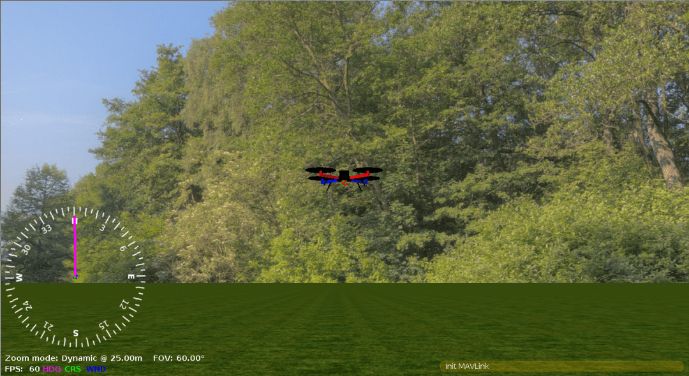

# Python QuickStart

::: warning
This page describes the native Python binding, which will be released to PyPI as `mavsdk` 4.0.0. Until then, `pip install mavsdk` still installs the gRPC-based MAVSDK-Python, whose quickstart is in the [MAVSDK-Python repository](https://github.com/mavlink/MAVSDK-Python). See [Migrating from MAVSDK-Python](migration.md) for what changes.
:::

## Prerequisites

* __Python 3.8+:__ run `python3 --version` in a terminal to check the installed version.
* __A running SITL instance__ ([Gazebo](https://docs.px4.io/main/en/sim_gazebo_gz/), [jMAVSim](https://docs.px4.io/main/en/sim_jmavsim/), …).
  A quick way to run a headless Gazebo SITL instance using docker is documented [here](https://github.com/jonasvautherin/px4-gazebo-headless).

## Install

MAVSDK is distributed through [PyPI](https://pypi.org/project/mavsdk/) and can be installed with `pip`, ideally in a [venv](https://docs.python.org/3/library/venv.html):

```sh
pip install mavsdk
```

The package wraps the MAVSDK C++ library, which it ships with, so there is nothing else to install. Wheels are available for:

* Linux x86_64 and aarch64 (64-bit Raspberry Pi OS included)
* macOS x86_64 and arm64
* Windows x86, x64 and arm64

::: tip
There are no wheels for 32-bit ARM Linux (armv6/armv7). On those, use the gRPC-based [`mavsdk-grpc`](https://pypi.org/project/mavsdk-grpc/) instead, or switch to a 64-bit OS.
:::

::: info
Coming from `mavsdk` 3.x or earlier? That was the gRPC-based MAVSDK-Python, which has a different API. See [Migrating from MAVSDK-Python](migration.md).
:::

The package provides two interfaces to the same functionality:

* `mavsdk.asyncio`: an asyncio API, used in this guide.
* `mavsdk`: a synchronous API using threads and callbacks, shown [further below](#the-synchronous-api).

## Run SITL

It is always good to make sure that SITL works before trying to connect MAVSDK to it.
One way is to run the following commands in the `pxh>` prompt when SITL is running:

```
commander takeoff
commander land
```

The simulated drone should takeoff and land.
If it doesn't, it may mean that SITL is not ready, or that there is a problem.

## Take off from MAVSDK

When we know that the simulator is ready, we can start an interactive Python shell that supports `await`:

```sh
python3 -m asyncio
```

Import MAVSDK into the environment by entering:

```python
from mavsdk.asyncio import Mavsdk, Configuration, ComponentType
from mavsdk.asyncio.plugins.action import ActionAsync
```

We then create a `Mavsdk` instance, configured as a ground station, and connect it to the port SITL sends MAVLink to:

```python
mavsdk = Mavsdk(Configuration.create_with_component_type(ComponentType.GROUND_STATION))
await mavsdk.add_any_connection("udpin://0.0.0.0:14540")
```

MAVSDK discovers the systems on that connection by itself. We wait up to 10 seconds for an autopilot to show up, and keep the resulting `System` as our handle to the drone:

```python
drone = await mavsdk.first_autopilot(10.0)
```

If no autopilot is found in time, `drone` is `None`, and it is worth checking that SITL is running and that the connection matches.

::: tip
With more than one vehicle, subscribe to `mavsdk.on_new_system()` and look at `await mavsdk.get_systems()` instead.
:::

Functionality is grouped into plugins, which are created for a system. To arm and take off, we use the `Action` plugin:

```python
action = ActionAsync(drone)
await action.arm()
await action.takeoff()
```

If everything went well, your drone should take off.
In the `pxh` console, you should see a log line like:

```bash
INFO [commander] Takeoff detected
```

If running a graphical interface, you should see the drone taking off.
Here is what it looks like in jMAVSim:



::: info
Make sure to send the `takeoff()` command within (at most) a few seconds of `arm()`; the drone will automatically disarm after a few seconds if it does not receive a command to takeoff.
:::

If a command is rejected, for instance because you try to arm before the drone has a GPS fix, the call raises an exception instead of returning.
This is not a bug: the vehicle refused the command, and the exception says which command failed and why.
Most MAVSDK functions can raise exceptions, which your code should handle with `try ... except`.

Now that the drone is flying, we can land:

```python
await action.land()
```

The same steps are in the [takeoff_and_land.py](https://github.com/mavlink/MAVSDK/blob/main/py/mavsdk/examples/asyncio/takeoff_and_land.py) example, which you can run as a script.

## The synchronous API

The `mavsdk` package itself offers the same functionality without asyncio. Calls block until they are done, and subscriptions take callbacks, which are called from a MAVSDK thread.
The plugins drop the `Async` suffix.

Taking off and landing looks like this:

```python
import time

from mavsdk import Mavsdk, Configuration, ComponentType
from mavsdk.plugins.action import Action

mavsdk = Mavsdk(Configuration.create_with_component_type(ComponentType.GROUND_STATION))
mavsdk.add_any_connection("udpin://0.0.0.0:14540")

drone = mavsdk.first_autopilot(10.0)
if drone is None:
    raise SystemExit("No autopilot found")

action = Action(drone)
action.arm()
action.takeoff()
time.sleep(5)
action.land()
```

## Examples

There are [examples for the asyncio API](https://github.com/mavlink/MAVSDK/tree/main/py/mavsdk/examples/asyncio) and [for the synchronous API](https://github.com/mavlink/MAVSDK/tree/main/py/mavsdk/examples) in the repository, covering telemetry, missions, parameters, calibration, and cameras.

## Next Steps

- Try the [other examples](https://github.com/mavlink/MAVSDK/tree/main/py/mavsdk/examples/asyncio).
- Browse the [C++ API reference](../cpp/api_reference/index.md) to get an overview of the functionality. The Python plugins mirror the C++ ones: the same plugins, with the same methods and types.
